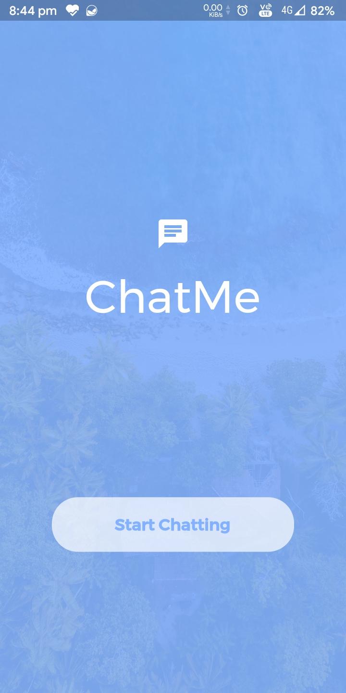
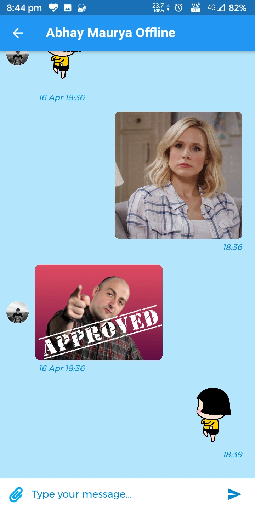
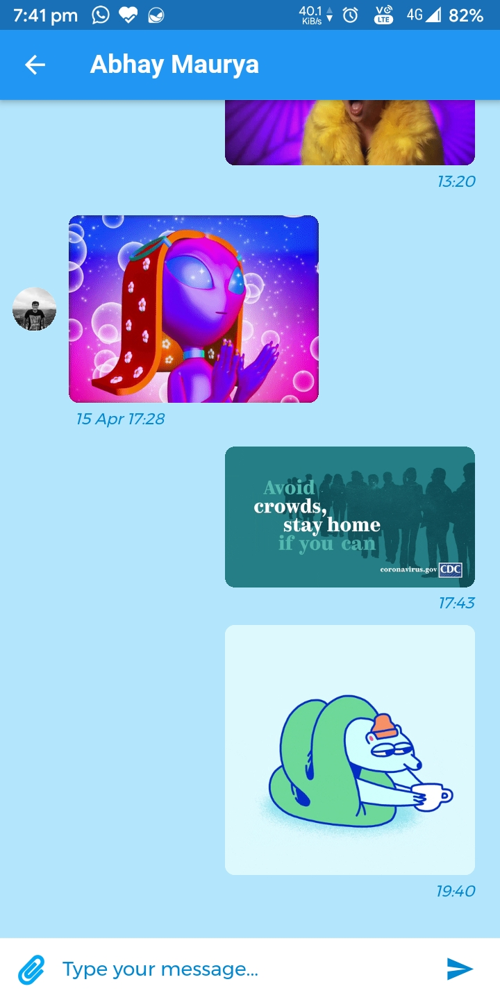
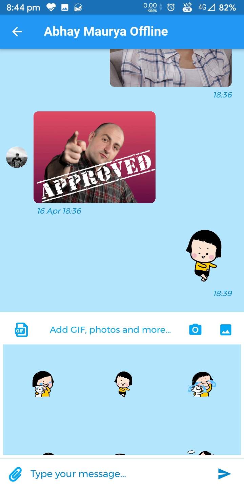
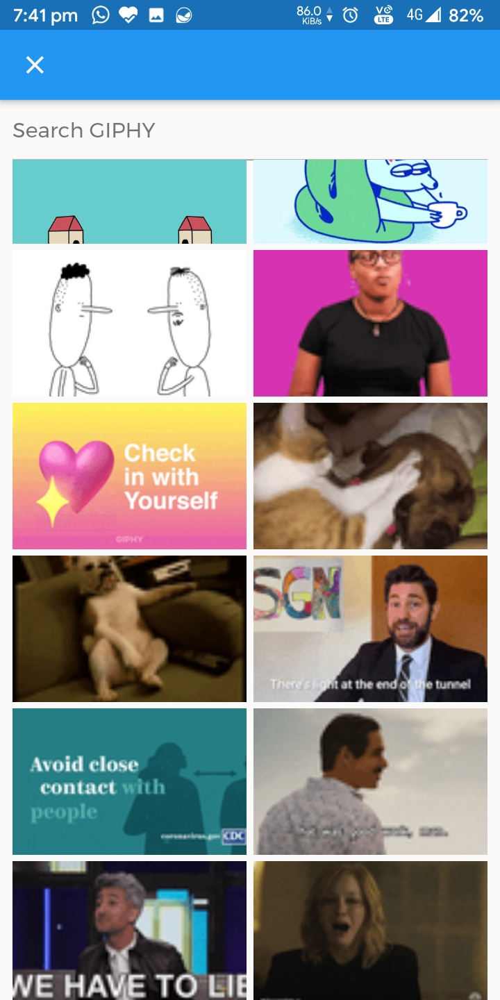
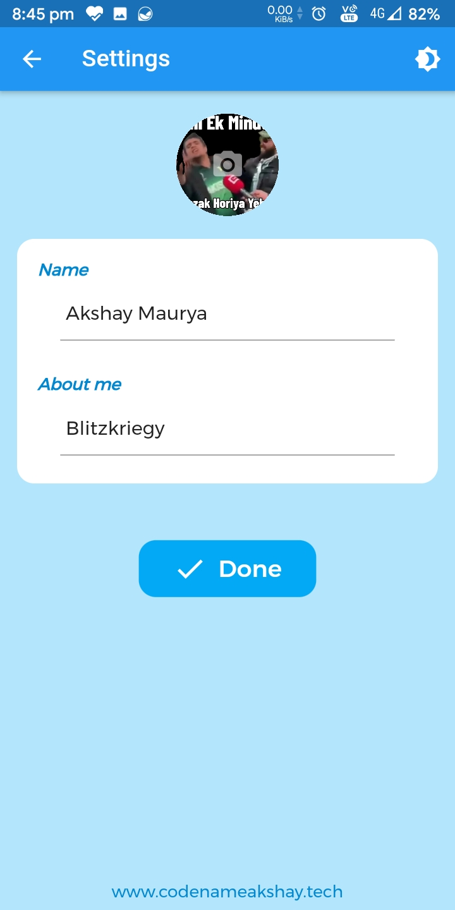
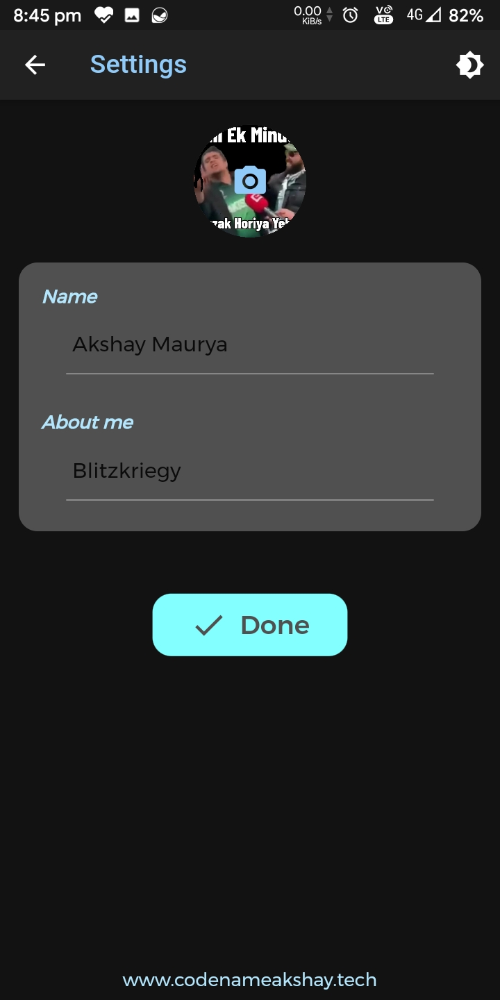
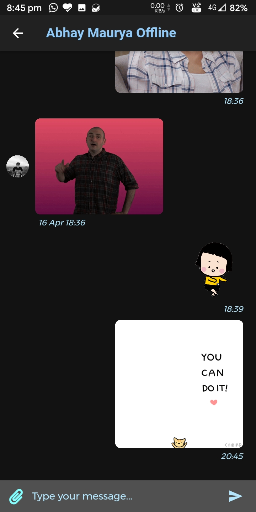
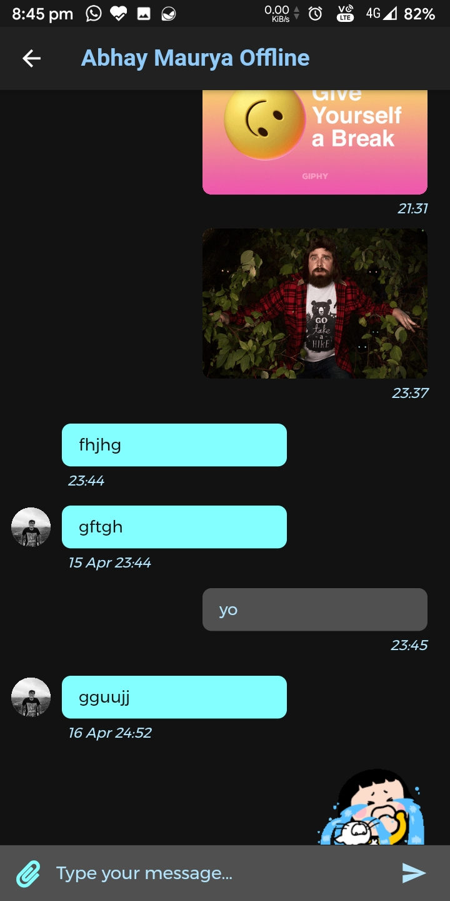
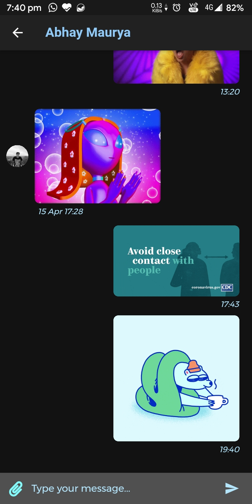

# ChatMe
A Flutter based chatting app which lets user chat from random peoples or strangers, has GIPHY gif support, sitckers, custom animations, dark mode, beautiful UI and it stores data at Google FireBase so no storage issues on user's phone.

## Things to do

- [ ] SplashScreen always requires pressing Start Chatting
- [ ] GroupChat
- [ ] Wallpapers
- [ ] Update settings page
- [x] Add examples
- [ ] Add more stickers
- [ ] Chat forwarding
- [ ] Copy chat text
- [ ] Allow image/gif from keyboard
- [ ] Allow video sharing
- [x] Show online/offline tag
- [ ] Allow music sharing
- [ ] Show chatting person info
- [ ] Show lastseen
- [ ] Notifications

## Demo

## Usage

Simply download this app from the `examples` folder depending on your phone chipset or clone the repo. Remember if you clone the repo, you need to have a GIPHY API key which needs to be used in `chat.dart` file in the `lib` directory.
